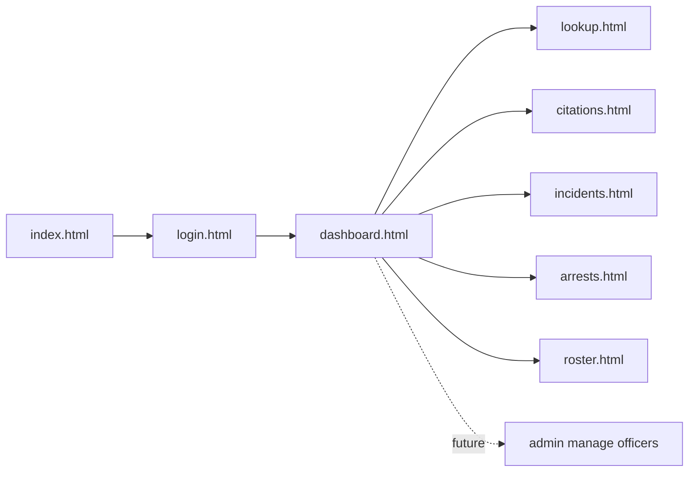
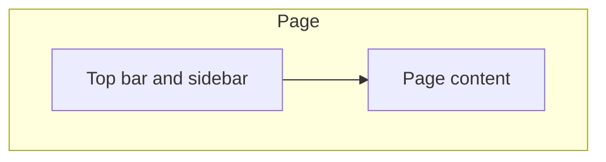
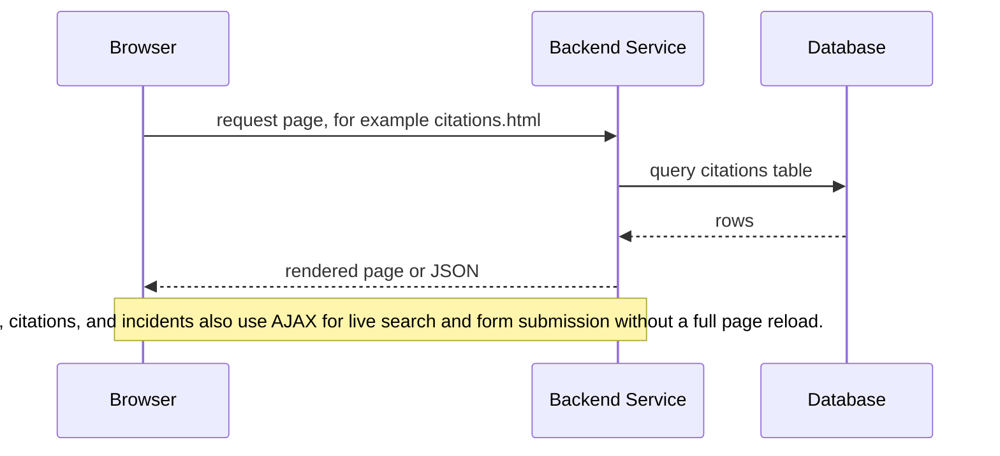
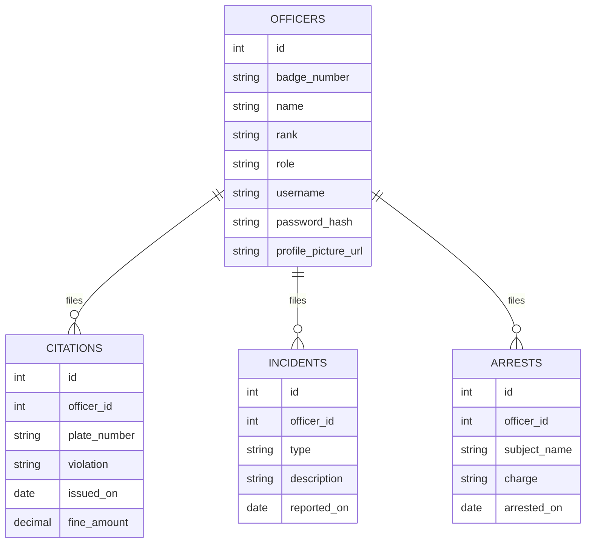

# Architecture

This document explains how the SDPD MDT project is structured and why it is built this way. It covers the page model, the folder layout, and how the different pieces talk to each other.

## What this app is

A fictional police Mobile Data Terminal (MDT) web app, themed around the San Diego Police Department for a roleplay setting. Officers log in and can look up records, file citations, file incident reports, and view the duty roster. It is an academic project for CNC111 - Network and Web Programming and is not affiliated with the real San Diego Police Department.

## Page model: multi page app

The site is built as a plain multi page app. Every screen is its own HTML file, not a single page that swaps views with JavaScript. The root `src/index.html` file simply redirects into the login page, which keeps the project close to what the course expects and maps cleanly onto server side pages once ASP.NET, NodeJS, or another backend technology is added in phase two *(TODO)*.

Each page loads up to three kinds of files:

1. `base.css`, which holds shared colors, fonts, and small reusable components like buttons
2. its own page specific CSS file
3. its own page specific JavaScript file, when that page needs one



Login is the only page without the shared navigation shell. Every other page shows the same top bar and sidebar, so a user always knows where they are.

## The shared shell

The top bar and sidebar look the same on every page after login. In phase one this markup is simply repeated in each HTML file, since the pages are static and there is no JavaScript requirement yet. Once phase two starts and AJAX is already part of the project, the shell will be pulled out into its own file and loaded into each page with a small fetch call. This avoids adding a JavaScript dependency just for navigation while phase one is graded on HTML and CSS alone.



## Folder layout

```mathematica
project-root/
  assets/
        data/            site manifest and any static data files
        fonts/
        images/
            favicon/
        scripts/          shared JavaScript
        styles/           base.css, shell.css, and one CSS file per page
  src/
        index.html
        login/
            login.html
            login.js
        dashboard/
            dashboard.html
            dashboard.js
        lookup/
            lookup.html
        citations/
            citations.html
        incidents/
            incidents.html
        arrests/
            arrests.html
        roster/
            roster.html
```

Assets are grouped by type in `assets/`, since a grader or a new contributor can open that folder and see every stylesheet or script at once. Pages are grouped by feature directly under `src/`, since each feature will eventually need its own server side logic and database queries in phase two, and keeping the related files close together makes that easier.

## Request flow, phase two

Once the server side and database are added, the flow for a typical page will look like this.



## Data model, planned/expected (phase two)

The database is small on purpose. Four tables cover everything the rubric asks for and everything the app needs to feel real.



The `role` column on officers is included from the start, even though the admin page does not exist yet. This means adding an admin screen later is just a new page, not a change to the database.
