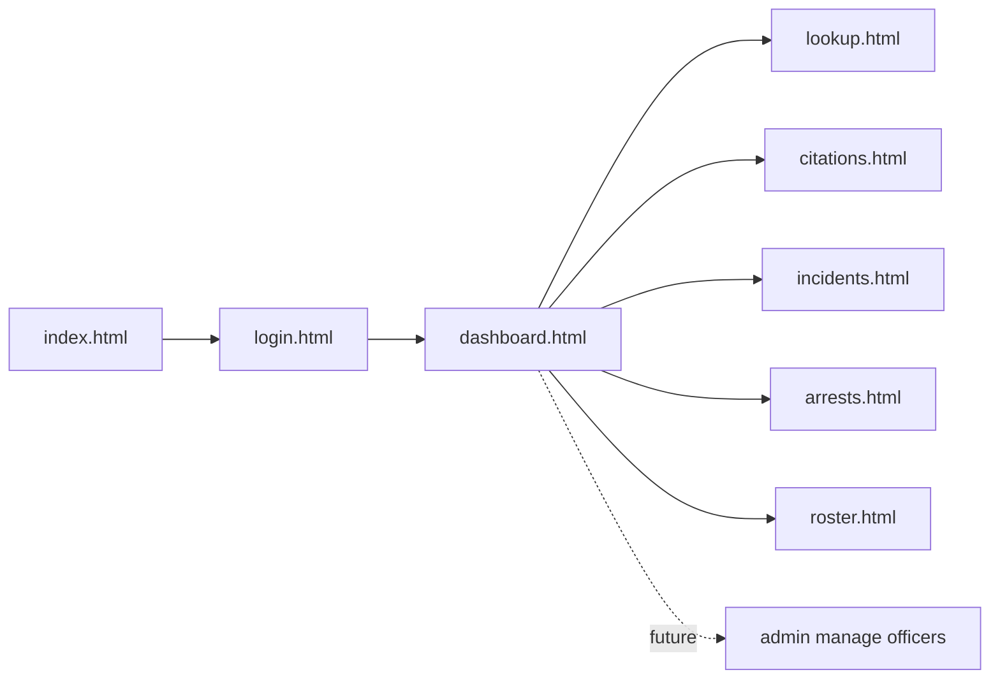
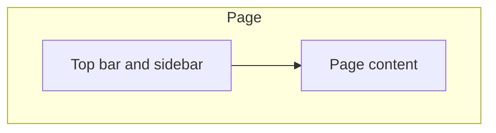
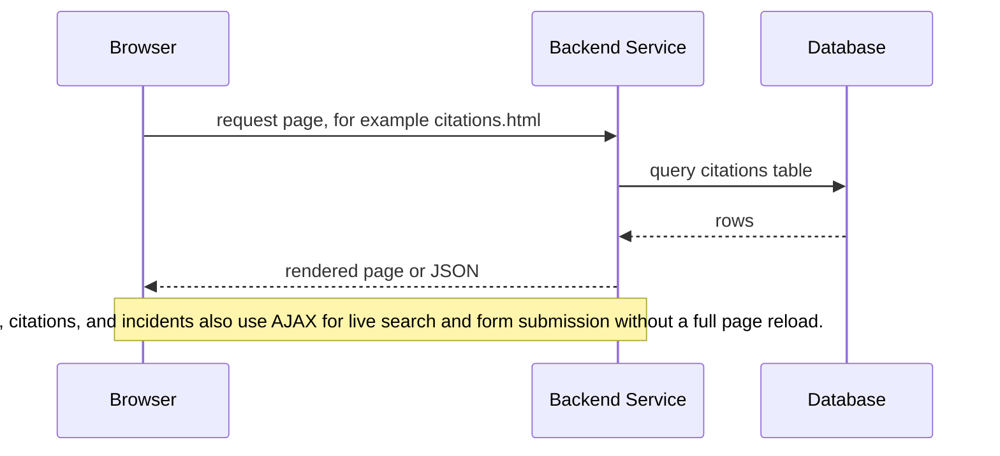
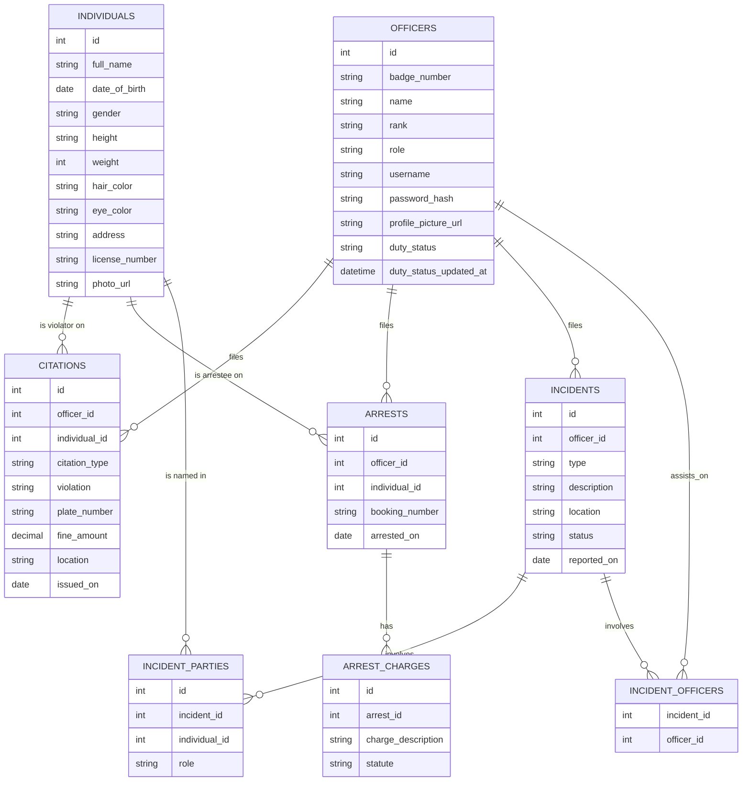

# Architecture

This document explains how the SDPD MDT project is structured and why it is built this way. It covers the page model, the folder layout, and how the different pieces talk to each other.

## What this app is

A fictional police Mobile Data Terminal (MDT) web app, themed around the San Diego Police Department for a roleplay setting. Officers log in and can look up records, file citations, file incident reports, and view the duty roster. It is an academic project for CNC111 - Network and Web Programming and is not affiliated with the real San Diego Police Department.

## Page model: multi page app

The site is built as a plain multi page app. Every screen is its own HTML file, not a single page that swaps views with JavaScript. The root `index.html` file simply redirects into the login page in the `src` folder, which keeps the project maps cleanly onto server side pages once ASP.NET, NodeJS, or another backend technology is added in future phases.

Each page is expected to load up to three kinds of files:

1. `base.css`, which holds shared colors, fonts, and small reusable components like buttons
2. its own page specific CSS file
3. its own page specific JavaScript file, when that page needs one



Login is the only page without the shared navigation shell. Every other page shows the same top bar and sidebar, so a user always knows where they are.

## The shared shell

The top bar and sidebar look the same on every page after login. In phase one this markup is simply repeated in each HTML file, since the pages are static and there is no JavaScript requirement yet. Once phase two starts and AJAX is already part of the project, the shell will be pulled out into its own file and loaded into each page with a small fetch call. This avoids adding a JavaScript dependency just for navigation while phase one is graded on HTML and CSS alone.



## Folder layout

```mathematica
project-root/
├── index.html
├── assets/
│   ├── data/
│   ├── fonts/
│   ├── images/
│   │   └── favicon/
│   ├── scripts/
|   |   └── main.js
│   └── styles/
├── src/
│   ├── login/
│   │   ├── login.html
│   │   └── login.js
│   ├── dashboard/
│   │   ├── dashboard.html
│   │   └── dashboard.js
│   ├── lookup/
│   │   └── lookup.html
|   |   └── lookup.js
│   ├── citations/
│   │   └── citations.html
|   |   └── citations.js
│   ├── incidents/
│   │   └── incidents.html
|   |   └── incidents.js
│   ├── arrests/
│   │   └── arrests.html
|   |   └── arrests.js
│   └── roster/
│       └── roster.html
|       └── roster.js
```

Assets are grouped by type in `assets/`, since a grader or a new contributor can open that folder and see every stylesheet or script at once. Pages are grouped by feature directly under `src/`, since each feature will eventually need its own server side logic and database queries in phase two, and keeping the related files close together makes that easier.

## Request flow, phase two planned

Once the server side and database are added, the flow for a typical page will look like this.



## Data model, for demonstration purposes

Although our main focus is on the front end, the database is a just a small SQLite file that is included in the project so that the front end can be tested with real data. The database is not a requirement, but it is included to make the site feel more realistic.

The database is small on purpose, but it has to separate two ideas: **officers**, who file records, and **individuals**, who records are filed *about*. A citation, an arrest, and an incident report all point at one or more individuals, and the same individual can show up across all three, so individuals get their own table instead of being a free-text name on every record. Officers get a duty status, since the roster page is a live view of that field rather than its own dataset.

### Entities

**OFFICERS** - the people who log in and file records.
- `id` - primary key
- `badge_number`
- `name`
- `rank`
- `role` - `officer` currently
- `username`
- `password_hash`
- `profile_picture_url`
- `duty_status` - one of `on_duty`, `on_break`, `off_duty`; defaults to `off_duty`
- `duty_status_updated_at` - timestamp of the last status change

`roster.html` does not read from a separate table. It queries `OFFICERS` filtered and grouped by `duty_status`, so changing status on the dashboard updates the roster immediately with no second write.

**INDIVIDUALS** - any person a record can be filed about: a citation's violator, an arrest's arrestee, or anyone named in an incident report. One row per real person in the roleplay, reused across every record type instead of re-entering their details each time.
- `id` - primary key
- `full_name`
- `date_of_birth`
- `gender`
- `height`, `weight`, `hair_color`, `eye_color` - optional physical description, useful for lookup and for incident reports written before an identity is confirmed
- `address`
- `license_number` - optional, for citations that involve a vehicle stop
- `photo_url` - every individual has a photo; for an arrestee this is effectively their booking photo, for a citation violator it may be a lookup/ID photo

**CITATIONS** - a citation is either a warning or a fine, never both, so the type is one column rather than two separate tables.
- `id` - primary key
- `officer_id` - FK to `OFFICERS`, the citing officer
- `individual_id` - FK to `INDIVIDUALS`, the violator
- `citation_type` - `warning` or `fine`
- `violation` - the statute or violation description
- `plate_number` - optional, only present when the stop involved a vehicle
- `fine_amount` - nullable; only set when `citation_type` is `fine`
- `location`
- `issued_on` - date/time

**ARRESTS**
- `id` - primary key
- `officer_id` - FK to `OFFICERS`, the arresting officer
- `individual_id` - FK to `INDIVIDUALS`, the arrestee
- `booking_number`
- `arrested_on` - date/time

**ARREST_CHARGES** - an arrest can carry more than one charge, so charges are their own table rather than a single text column on `ARRESTS`.
- `id` - primary key
- `arrest_id` - FK to `ARRESTS`
- `charge_description`
- `statute` - optional, e.g. `"§ 459/460(A) PC"`

**INCIDENTS**
- `id` - primary key
- `officer_id` - FK to `OFFICERS`, the reporting officer
- `type` - e.g. `Assault`, `Burglary`, `Traffic Collision`
- `description`
- `location`
- `status` - e.g. `Open`, `Closed`, `Closed: Cleared by Arrest`
- `reported_on` - date/time

**INCIDENT_PARTIES** - links individuals to an incident and records why they're in it. An individual can appear in the same incident more than once only with different roles (for example listed as a witness and, later, reclassified as a suspect), so `(incident_id, individual_id, role)` together identify a row.
- `id` - primary key
- `incident_id` - FK to `INCIDENTS`
- `individual_id` - FK to `INDIVIDUALS`
- `role` - `suspect`, `victim`, `witness`, or `other`

**INCIDENT_OFFICERS** - officers assisting on an incident beyond the one who filed it (junction table, no extra columns needed).
- `incident_id` - FK to `INCIDENTS`
- `officer_id` - FK to `OFFICERS`

### Relationships



### How this maps to the pages

- `lookup.html` searches `INDIVIDUALS` by name, and, for a matched individual, pulls their citations, arrests, and incident appearances (via `INCIDENT_PARTIES`) into one profile view, photo included.
- `citations.html` creates rows in `CITATIONS`, creating an `INDIVIDUALS` row first if the violator isn't already on file.
- `arrests.html` creates a row in `ARRESTS` plus one or more rows in `ARREST_CHARGES`.
- `incidents.html` creates a row in `INCIDENTS`, then one `INCIDENT_PARTIES` row per person named (suspect, victim, witness, or other) and one `INCIDENT_OFFICERS` row per assisting officer.
- `dashboard.html` is where an officer sets their own `duty_status`, which is the same write `roster.html` reads from.

The `role` column on officers is included from the start, even though the admin page does not exist yet. This means adding an admin screen later is just a new page, not a change to the database.
