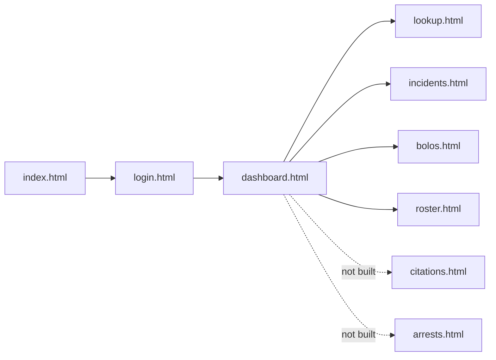
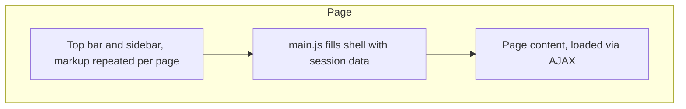
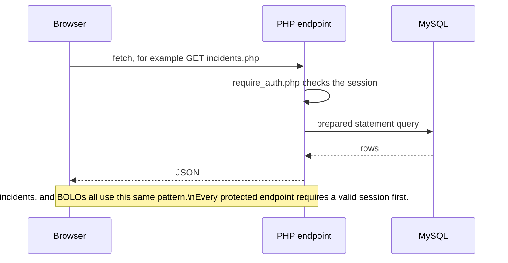
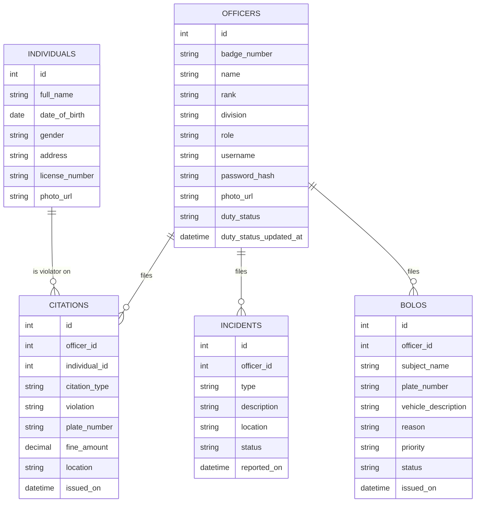

# Architecture

This document explains how the SDPD MDT project is structured and why it is built this way. It covers the page model, the folder layout, and how the different pieces talk to each other. It has been updated for Phase II; where something changed from the original Phase I plan, that's called out directly rather than silently rewritten.

## What this app is

A fictional police Mobile Data Terminal (MDT) web app, themed around the San Diego Police Department for a roleplay setting. Officers log in and can look up records, file incident reports and BOLOs, and view the duty roster. It is an academic project for CNC111, Network and Web Programming, and is not affiliated with the real San Diego Police Department. It is a proof of concept demonstrating the course's techniques working together end to end, not a complete or polished product.

## Page model: multi page app

The site is a plain multi page app. Every screen is its own HTML file, not a single page that swaps views with JavaScript. This keeps the project simple to reason about and maps cleanly onto the PHP endpoints added in Phase II.

Each page loads:

1. `base.css`, shared colors, fonts, and small reusable components like buttons
2. its own page specific CSS file
3. its own page specific JavaScript file, which now handles real data through the API in Phase II



Login is the only page without the shared navigation shell. Every other page shows the same top bar and sidebar, with the officer's real name, badge, and duty status now rendered from their session, not hardcoded.

## The shared shell

The top bar and sidebar look the same on every page after login. As planned in the Phase I version of this document, the markup itself is still repeated per page rather than pulled into one shared HTML fragment. What changed is that the shell's *content* is no longer static: `main.js` exposes a `renderTopbar()` function that every page calls after confirming a session exists, filling in the officer's real name, badge number, and duty status, and wiring the logout button to actually call the logout endpoint instead of just linking back to the login page.



## Folder layout

```
project-root/
├── api
│   ├── bolos.php
│   ├── citations.php
│   ├── db.php
│   ├── error_response.php
│   ├── incidents.php
│   ├── login.php
│   ├── logout.php
│   ├── lookup.php
│   ├── officers.php
│   ├── require_auth.php
│   └── session.php
├── assets
│   ├── data
│   │   ├── schema.sql
│   │   ├── seed.sql
│   │   └── site.webmanifest
│   ├── images
│   │   ├── favicon
│   │   │   ├── android-chrome-192x192.png
│   │   │   ├── android-chrome-512x512.png
│   │   │   ├── apple-touch-icon.png
│   │   │   ├── favicon-16x16.png
│   │   │   ├── favicon-32x32.png
│   │   │   └── favicon.ico
│   │   └── sdpd-logo.png
│   ├── scripts
│   │   └── main.js
│   └── styles
│       ├── arrests.css
│       ├── base.css
│       ├── bolos.css
│       ├── citations.css
│       ├── dashboard.css
│       ├── incidents.css
│       ├── login.css
│       ├── lookup.css
│       ├── roster.css
│       └── shell.css
├── errors
│   ├── 401.html
│   └── 404.html
├── src
│   ├── arrests
│   │   ├── arrests.html
│   │   └── arrests.js
│   ├── bolos
│   │   ├── bolos.html
│   │   └── bolos.js
│   ├── citations
│   │   ├── citations.html
│   │   └── citations.js
│   ├── dashboard
│   │   ├── dashboard.html
│   │   └── dashboard.js
│   ├── incidents
│   │   ├── incidents.html
│   │   └── incidents.js
│   ├── login
│   │   ├── login.html
│   │   └── login.js
│   ├── lookup
│   │   ├── lookup.html
│   │   └── lookup.js
│   └── roster
│       ├── roster.html
│       └── roster.js
├── .editorconfig
├── .gitattributes
├── .gitignore
├── .htaccess
├── .prettierignore
├── .prettierrc.json
├── ARCHITECTURE.md
├── CODE_STANDARD.md
├── eslint.config.mjs
├── index.html
├── package.json
├── PHASE_II_NOTES.md
└── README.md
```

`citations/` and `arrests/` folders are not present; see `PHASE_II_NOTES.md`. `api/citations.php` exists and works even though the page that would call it doesn't.

## Request flow, as implemented



Every endpoint except `login.php` and `session.php` requires an active session, checked through a shared `require_auth.php` include. A failed session check returns a JSON 401, and the calling page's JavaScript redirects the browser to `access-denied.html`. Worth noting that PHP server code, API, and its handling is not the focus of this course, so the backend is intentionally simple and not a full REST API. It is just enough to demonstrate the front end techniques learned in class.

## Data model, as implemented

Four tables were implemented instead of the seven originally sketched in the Phase I version of this document: `officers`, `individuals`, `citations`, `incidents`, plus `bolos`, added during Phase II.



### How this maps to the pages

- `lookup.html` searches `INDIVIDUALS` by name and `INCIDENTS` by type or description. Vehicle, citation, and arrest lookup are present in the form but disabled.
- `incidents.html` lists and creates rows in `INCIDENTS`.
- `bolos.html` lists and creates rows in `BOLOS`.
- `dashboard.html` reads aggregate counts across all four tables plus a live view of active `BOLOS`.
- `roster.html` queries `OFFICERS` directly, same as planned in Phase I, polling every 60 seconds rather than only loading once.
- Citations can be created and listed through `api/citations.php`, which is complete, but no page currently calls it.

### What was planned but not implemented

`ARRESTS`, `ARREST_CHARGES`, `INCIDENT_PARTIES`, and `INCIDENT_OFFICERS` were designed in the original Phase I entity relationship diagram and are not part of the implemented schema. The `role` column on officers is still included from the start, even though the admin page it would support does not exist, for the same reason noted in Phase I: adding it later is a new page, not a schema change. Full reasoning on what's left out and why lives in `PHASE_II_NOTES.md`.
